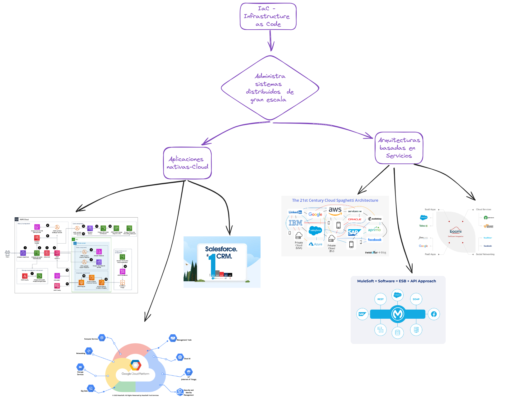
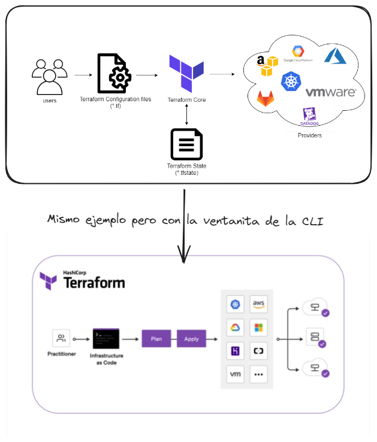

# Terraform Associate Notes

## ¡IaC en ayuda la administracion de estos sistemas!
- Infastructure as Code, facilita la administracion de sistemas distribuidos a lo largo de la WWW - World Wide Web, o web (simplemente) en:
    - Aplicaciones Nativas de la Nube - Cloud Native Apps y Arquitecturas basdas en Servicios - service based arquitectures:
        - Ejemplos de empresas como:
            - AWS - Amazon Web Services
        - Lo carcaterizan:
            - Aprovecha ventajas de la nube como:
                - Microservicios
                - Contenedores
                - Escalabilidad y Elasticidad
                - Resiliencia (Tolerancia al fallo)
                - Atuomatizacion 
                - APIs - interfaces REST, SOAP etc. 




## IaC utiliza Archivos de configuracion para administrar infraestructura 
- usa ***configuration files*** en evz de una interfaz gráfica - UI
- Son secuencias puestas en una CLI - Command Line Interface, a traves de un script (codigo para *automatizar tareas*)
    - Los **Scripts** permiten realizar una y otra vez de manera consistente, repetible y segura:
        - **Construir o compilar (build)**
        - **Cambiar y administrar**
        - **Rastrear (track)**
        - **versionar, reusar y compartir** - despliegues, codigo de configuracion, etc (version history, *just like Git & GitHub*!)
    

## ¡Terraform es la IaC Agnostica mas usada en el mundo Dev!
- Terraform es el motor de aprovisionamiento más usado en el mundo, ¿Porqué?
    - Es facilmente legible por un humano y ejecutable por la computadora 💻, ademas se puede escribir código de una manera rápida ⚡. 
    - Por medio de ```terraform state``` permite rastrear los cambios del sistema desplegado.
    - Se puede colaborar con codigo de manera remota y segura justo como GitHub.
    - 
